# Introduce

-   Website is remake from (https://www.youtube.com/watch?v=0cPCMIuDk2I&t=22194s)
-   Frontend: NextJs ( Nivo.rocks, @mui/x-data-grid, @mui/x-date-pickers )
-   Api: RTK-Query
-   Backend: NestJs
-   Database: mongoDB (mongoose)
-   UI/UX: material UI
-   Demo: https://banhthecake-admin.vercel.app/

# Features

-   Full responsive
-   Dark mode (Default)
-   Skeleton Loading
-   Charts

# Preview

-   Dark mode

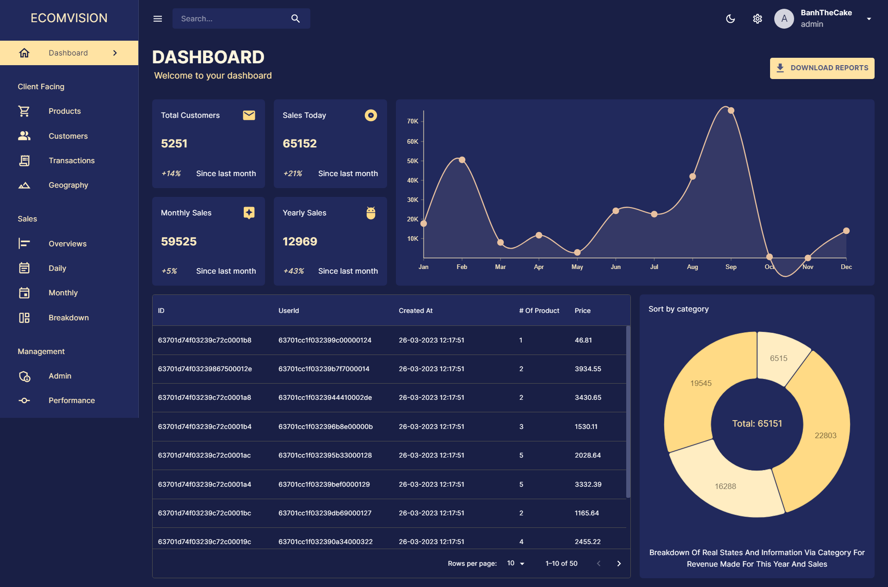

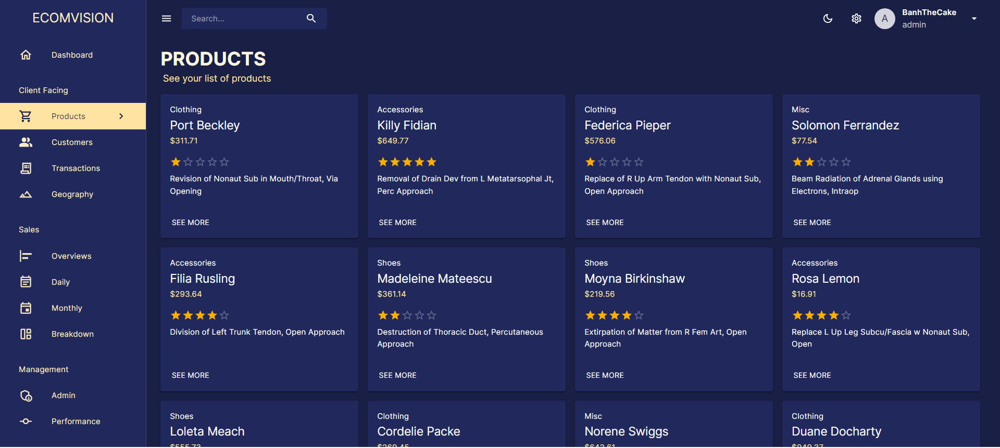

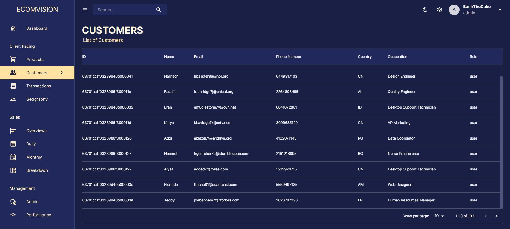

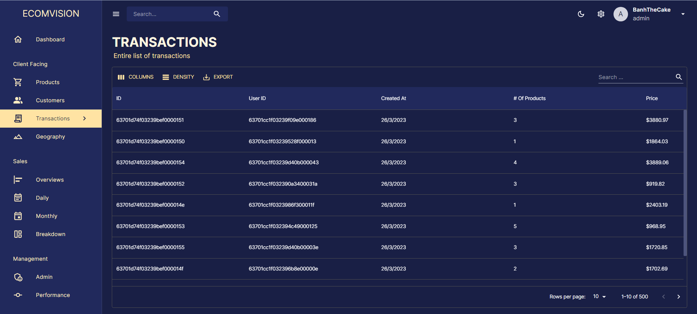

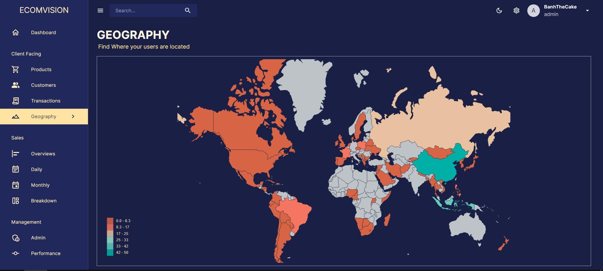

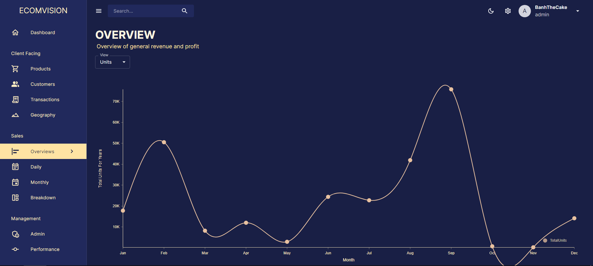

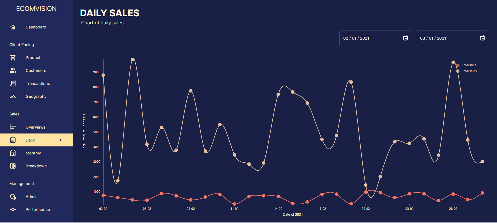

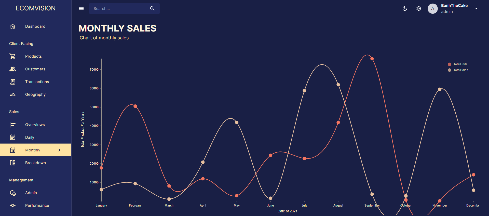

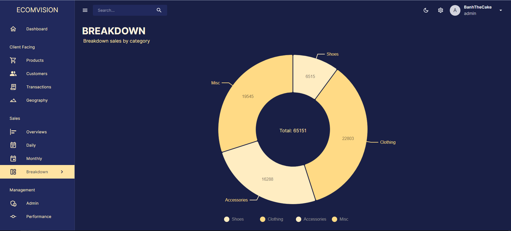

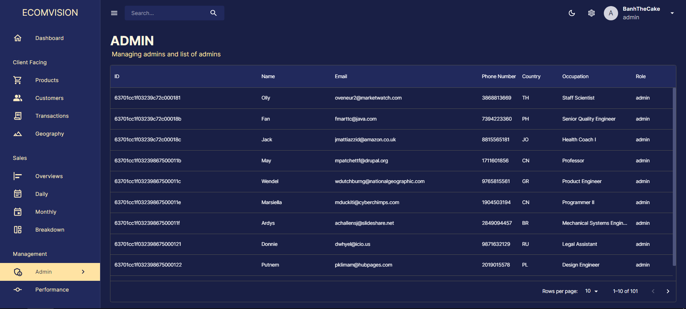

-   Light mode

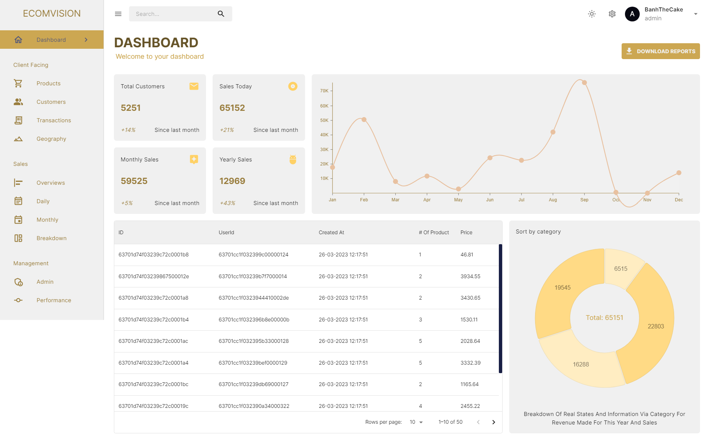

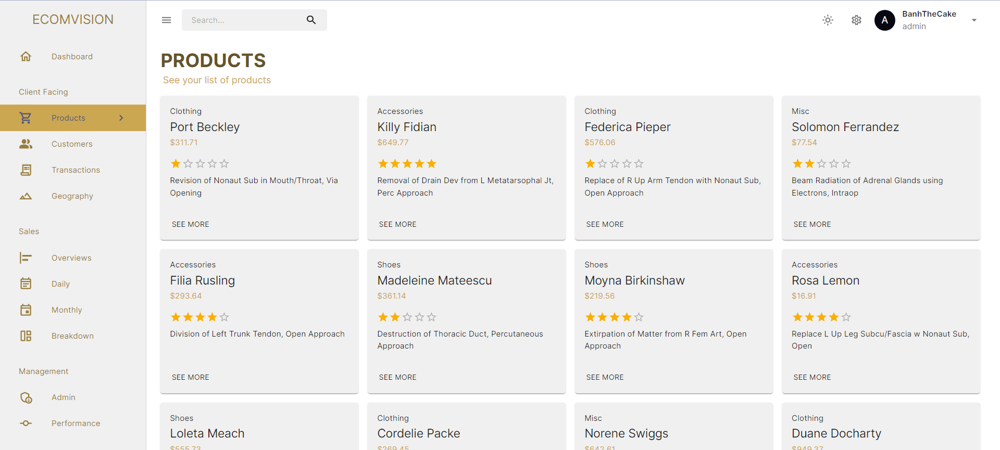

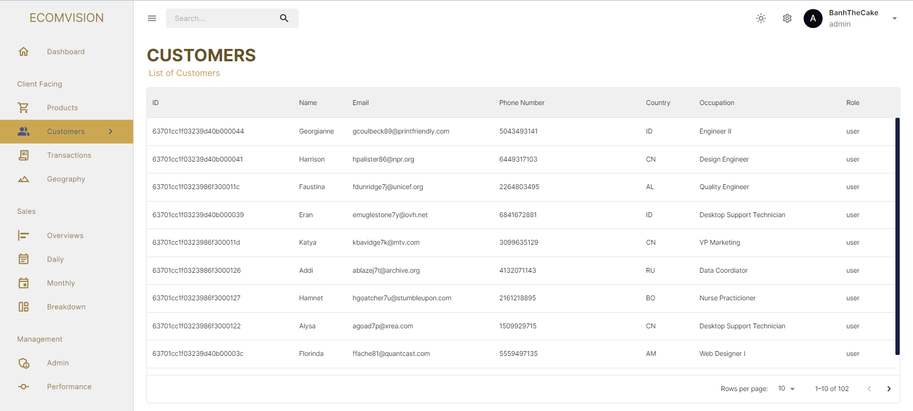
